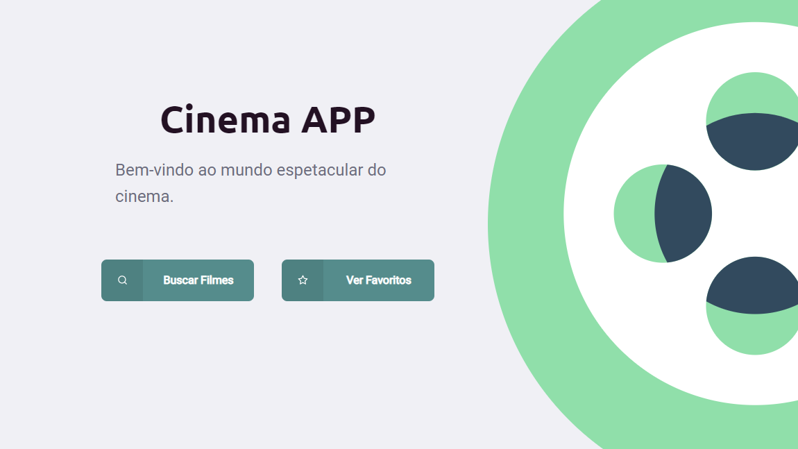

<h1 align="center">
    
</h1>
<h4 align="center"> 
# Cinema APP.

💻 an application made with node.js & react
</h4>

<h1 align="center">
  
</h1>
<h1 align="center">
    
</h1>

## Sobre a aplicação
#### O objetivo do aplicativo é possibilitar que o usuário crie uma lista de filmes favoritos particular.

## Disponível em
[netlify](https://www.rocketseat.com.br)

## Clone o projeto
#### Clone Repository
$ git clone https://github.com/marcoscmartins/dev-cinemapp.git

## Como executá-lo
#### Go to web folder
$ cd Proffy/web

#### Install Dependencies
$ yarn install

#### Run Aplication
$ yarn start
Go to http://localhost:3000/ to see the result.

## Desenvolvido com
#### Essas principais tecnologias

- [Node.js](https://nodejs.org/en/) 
- [React](https://reactjs.org)